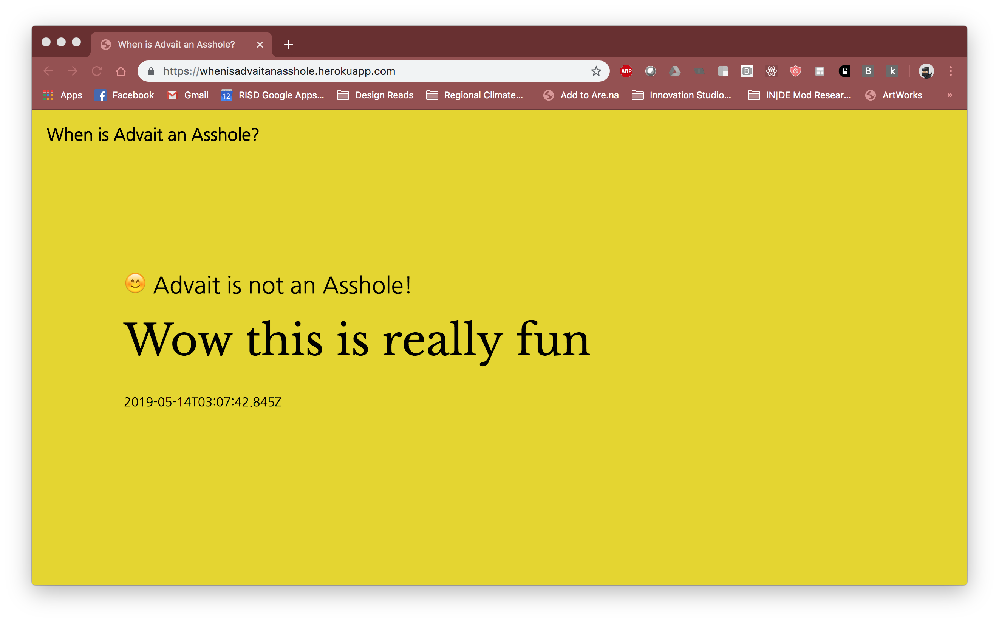
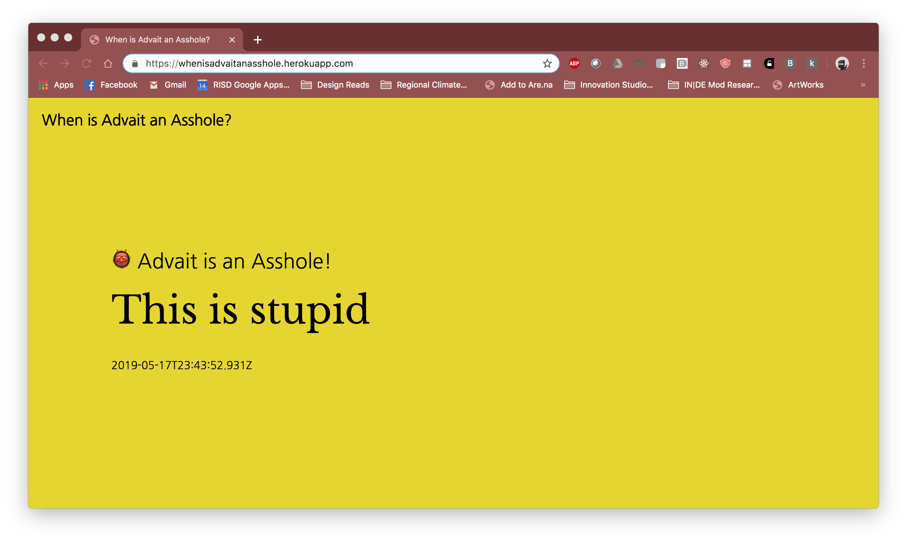

# when-is-advait-an-asshole

An addition to the Browsing Browser Extension Suite. A key logger that performs sentiment analysis on everything the user types. Everything a user texts is then broadcast to a website along with the sentiment ranking in the form of "is and asshole or is not an asshole."

With the internet has come a flurry of digital artifacts (images, video, text, audio) that are both permanent and easily accessible. These artifacts are not only ubiquitous but are also incredibly easy to judge. We all know of figures whose prominence was felled through the unearthing of old tweets. Digital artifacts have become a source of leverage for the masses to hold the privileged few accountable.

This project was a chance to imagine how the false authority of machine learning algorithms could be used to bolster this recent phenomenon. A policed internet where Artificial Intelligence provides the "objective" opinion on toxic content, and a permanent archive readily accessible by the masses. How might my behavior on the internet change or be received, should there be an archive of everything I've ever said, all labeled "objectively" by an anonymous algorithm in the cloud.

## Project Details

This project consists of a chrome extension logging everything the user says. Should a user press enter or be idle for more than five seconds, the extension sends whatever the user has typed in that interval to a server. I am using Google's Perspective API (basically the Toxicity model from tfjs) to score the sentences. These are then relayed to the main website where they are displayed. Examples for the two types of outcomes are below.

Example of a non-asshole statement

Example of an asshole statement
